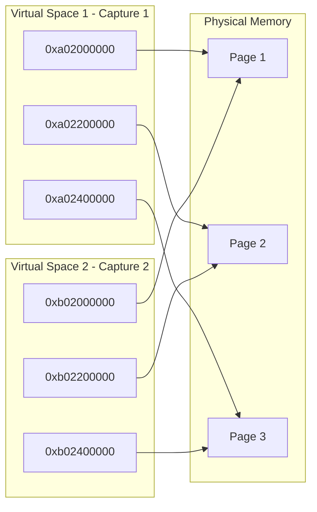

# xLLM Graph Mode Multi-Shape Memory Reuse Technical Documentation

## Overview

This document describes the multi-shape memory reuse solution for Graph Mode (including CUDAGraph, ACLGraph, MLUGraph) in xLLM. The solution has two implemented mechanisms: (1) **Graph capture memory reuse**: different shapes of Graphs share physical memory, reducing memory usage from `sum(shape)` to `max(shape)`, implemented via CUDA Virtual Memory Management (VMM) API's multi-virtual address space mapping; (2) **Multi-shape input tensor reuse**: persistent parameters (PersistentParam) pre-allocate buffers with max shape, and replay uses slices to adapt to different actual shapes, so input-side memory also stays at `max(shape)`.

**Scope**:
- **CUDAGraph**: Graph Mode for CUDA platform (currently main implementation)
- **ACLGraph**: Graph Mode for NPU platform (architecture supported, pending adaptation)
- **MLUGraph**: Graph Mode for MLU platform (architecture supported, pending adaptation)

## 1. Problem Background

### 1.1 Problem Description

When using Graph Mode (CUDAGraph/ACLGraph/MLUGraph) for inference with different shapes, GPU/NPU/MLU memory usage was found to grow linearly with the number of captures, reaching `sum(shape)` instead of the expected `max(shape)`.

### 1.2 Root Cause

- PyTorch's `CUDACachingAllocator` (CUDA platform) or other platform allocators allocate independent memory blocks for each Graph capture
- Graph Mode requires memory addresses to remain stable between capture and replay
- Different shapes of Graphs require different memory layouts, causing each shape to need independent memory
- Since Graphs may be replayed at any time, these memories cannot be freed, leading to memory accumulation
- Final memory usage = `sum(shape)` instead of the expected `max(shape)`

### 1.3 Constraints

- Graphs of different shapes **do not replay simultaneously**, allowing sharing of underlying physical memory
- Need to support dynamically appearing new shapes, performing graph capture on demand
- **Not allowed** to re-capture already captured shapes (all shapes must be cached)

### 1.4 Technical Challenges in Problem Solving

The following technical challenges were encountered when implementing the memory reuse solution:

**Challenge 1: Virtual Address Reuse Conflict**

The initial solution attempted to reuse the same virtual address space through `reset_allocation_pointer()`:
- Reset allocation pointer to start position before each capture
- Expected different shapes of Graphs to reuse the same virtual address

**Problems Encountered**:
- PyTorch's `CUDACachingAllocator` uses an `allocated_blocks` map to track memory blocks by address
- When reusing virtual addresses, newly allocated addresses overwrite old entries in `allocated_blocks`
- When tensors in old Graphs are destructed, `free()` is called, but the address is no longer in `allocated_blocks`
- Triggers `invalid device pointer` error, causing program crash

**Solution**:
- Adopt multi-shape memory reuse solution: each capture uses a new virtual address (underlying implementation)
- All shapes of Graphs share the same physical memory
- Both avoids address conflicts and achieves physical memory reuse

## 2. Similar Problems and Solutions in Other Products

### 2.1 vLLM's Solution

**vLLM's Approach**:

1. **Shared Memory Pool**:
   - Use `torch.cuda.graph_pool_handle()` to obtain a shared memory pool
   - All Graphs of different shapes share the same memory pool
   - Code location: `vllm/v1/worker/gpu/cudagraph_utils.py`
   ```python
   self.pool = torch.cuda.graph_pool_handle()
   ```

2. **Capture Order Optimization**:
   - **Capture large shapes first, then small shapes**
   - Small shapes can reuse free blocks in the memory pool allocated by large shapes
   - Implementation: Sort in descending order in `capture_graphs()` function
   ```python
   # Capture larger graphs first.
   sizes_to_capture = sorted(set(cudagraph_sizes.values()), reverse=True)
   ```

3. **Memory Management**:
   - Relies on PyTorch's `CUDACachingAllocator` memory pool management
   - Maximizes memory reuse through capture order
   - Explicit comment in `capture_model()`:
     ```python
     # Capture the large shapes first so that the smaller shapes
     # can reuse the memory pool allocated for the large shapes.
     ```

**Limitations**:
- Memory accumulation may still occur: each Graph holds its own memory blocks, which cannot be freed even when inactive
- Memory reuse depends on memory pool's free block management, not thorough enough
- When there are many different shapes, memory usage still grows linearly

### 2.2 SGLang's Solution

**SGLang's Approach**:

1. **Global Memory Pool**:
   - Use `torch.cuda.graph_pool_handle()` or global graph memory pool
   - Set global memory pool in `piecewise_cuda_graph_runner.py`:
   ```python
   if get_global_graph_memory_pool() is None:
       set_global_graph_memory_pool(self.device_module.graph_pool_handle())
   set_graph_pool_id(get_global_graph_memory_pool())
   ```

2. **Capture Order Optimization**:
   - Also adopts **capture large shapes first, then small shapes** strategy
   - Explicit comment in `cuda_graph_runner.py`:
     ```python
     # Capture the large shapes first so that the smaller shapes
     # can reuse the memory pool allocated for the large shapes.
     ```

3. **Special Handling for Multimodal Scenarios**:
   - SGLang has dedicated CUDA Graph implementation for multimodal encoders like ViT (Vision Transformer)
   - Document mentions: "If there are many distinct S values, we need to increase VRAM usage which is graph-private memory pools for many graphs."
   - (Note: VRAM stands for Video RAM, referring to GPU memory)
   - Document source: `sglang/docs/advanced_features/cuda_graph_for_multi_modal_encoder.md` line 26
   - This indicates SGLang recognizes that memory usage grows when there are many different shapes (because each graph has an independent memory pool)

4. **Piecewise CUDA Graph Support**:
   - SGLang supports piecewise CUDA Graph, can capture layer by layer
   - Uses weak references to reduce memory usage

**Limitations**:
- Similar to vLLM, relies on PyTorch memory pool management
- Document mentions: when there are many different shapes, VRAM usage needs to be increased (due to graph-private memory pools)
- Memory reuse depends on memory pool's free block management, when there are many different shapes, memory usage may approach `sum(shape)`

### 2.3 Solution Comparison Summary

| Feature | vLLM Solution | SGLang Solution | xLLM Solution |
|------|-----------|-------------|-----------|
| **Memory Reuse Mechanism** | Shared memory pool + capture order optimization | Global memory pool + capture order optimization + Piecewise Graph | Multi-shape memory reuse (multi-virtual address spaces map to same physical memory) |
| **Physical Memory Usage** | May reach `sum(shape)` | May approach `sum(shape)` (document mentions graph-private pools) | `max(shape)` ✅ |
| **Address Conflicts** | None (shared memory pool) | None (global memory pool) | None (different virtual addresses) |
| **Implementation Complexity** | Low (uses PyTorch existing mechanisms) | Low-Medium (supports Piecewise) | Medium (requires custom VMM allocator + supports Piecewise) |
| **Memory Efficiency** | Depends on memory pool management | Depends on memory pool management | Optimal ✅ |
| **Special Scenario Support** | Standard CUDA Graph | Piecewise Graph + Multimodal | Piecewise Graph (implemented)<br>CUDAGraph (implemented)<br>ACLGraph/MLUGraph (architecture supported) |
| **Memory Growth Issue** | Grows to `sum(shape)` when many different shapes | Document mentions increased memory usage when many different shapes (graph-private pools) | Grows to `max(shape)` then stops ✅ |

## 3. Intermediate Activations Multi-Shape Reuse Solution

### 3.1 Core Concept

**Multi-Shape Memory Reuse**:

- **Functional Goal**: Different shapes of Graphs share physical memory, memory usage = `max(shape)` instead of `sum(shape)`
- **Implementation Mechanism**: Each Graph capture uses a new virtual address space, all virtual address spaces map to the same physical memory
- **Address Isolation**: PyTorch's `allocated_blocks` (CUDA platform) or other platforms' block management mechanisms use different virtual addresses to avoid conflicts
- **Memory Efficiency**: Physical memory usage = `max(shape)`

**Platform Support**:
- **CUDA Platform**: Implemented using CUDA VMM API (current implementation)
- **NPU/MLU Platform**: Architecture supports, needs adaptation to corresponding platform VMM APIs

**Graph Mode Support**:
- **Standard CUDA Graph**: Supports full Graph capture for decode phase
- **Piecewise CUDA Graph**: Supports layer-by-layer capture for prefill phase (piecewise capture)
- Both modes use the same multi-shape memory reuse mechanism

### 3.2 Architecture Diagram



### 3.3 Key Technologies

**CUDA Virtual Memory Management (VMM) API**:

- `cuMemAddressReserve`: Reserve virtual address space
- `cuMemCreate`: Create physical memory handle
- `cuMemMap`: Map physical memory to virtual address space
- `cuMemUnmap`: Unmap
- `cuMemRelease`: Release virtual address space or physical memory handle
- `cuMemSetAccess`: Set memory access permissions

**Key Feature**: The same physical memory handle can be mapped to multiple virtual address spaces.

### 3.4 Implementation Architecture

#### 3.4.1 Component Structure

```
┌─────────────────────────────────────────────────────┐
│         CudaGraphExecutorImpl                      │
│  - reset_vmm_allocator_offset()                           │
│  - get_vmm_mempool_ptr()                          │
│  - MemPoolContext activation                      │
└────────────────┬────────────────────────────────────┘
                 │
                 ▼
┌─────────────────────────────────────────────────────┐
│         VMMTorchAllocator                           │
│  - raw_alloc() / raw_alloc_with_stream()           │
│  - raw_delete()                                     │
│  - Implements CUDAAllocator interface              │
└────────────────┬────────────────────────────────────┘
                 │
                 ▼
┌─────────────────────────────────────────────────────┐
│         SharedVMMAllocator                          │
│  - switch_to_new_virtual_space()                   │
│  - allocate()                                      │
│  - extend_mapping()                                │
│  - Manages VirtualSpace[] and PhyMemHandle[]      │
└────────────────┬────────────────────────────────────┘
                 │
                 ▼
┌─────────────────────────────────────────────────────┐
│         vmm_api (Platform abstraction)              │
│  - create_vir_ptr()                                │
│  - create_phy_mem_handle()                         │
│  - map() / unmap()                                 │
│  - release_vir_ptr() / release_phy_mem_handle()    │
└─────────────────────────────────────────────────────┘
```

#### 3.4.2 Core Class Design

**SharedVMMAllocator**:

- **Responsibility**: Manage physical memory and multiple virtual address spaces
- **Key Data Structures**:
  ```cpp
  struct VirtualSpace {
    VirPtr base_ptr;       // Virtual address base
    size_t reserved_size;  // Reserved virtual address space size
    size_t mapped_size;    // Mapped physical memory size
  };
  std::vector<VirtualSpace> virtual_spaces_;  // All virtual address spaces
  std::vector<PhyMemHandle> handles_;        // Physical memory handles (shared)
  ```
- **Key Methods**:
  - `switch_to_new_virtual_space()`: Create new virtual address space and map existing physical memory
  - `allocate()`: Allocate memory from current virtual space
  - `extend_mapping()`: Create new physical memory and map to all virtual spaces

**VMMTorchAllocator**:

- **Responsibility**: Adapt `SharedVMMAllocator` to PyTorch's `CUDAAllocator` interface
- **Key Methods**:
  - `raw_alloc()` / `raw_alloc_with_stream()`: Call `SharedVMMAllocator::allocate()`
  - `raw_delete()`: Call `SharedVMMAllocator::deallocate()` (no-op)

**Integration Point** (in `CudaGraphExecutorImpl`):

```cpp
// 1. Switch to new virtual address space before capture
reset_vmm_allocator_offset(device_.index());

// 2. Activate VMM MemPool (CUDA platform uses PyTorch MemPool)
c10::cuda::MemPoolContext mempool_ctx(get_vmm_mempool_ptr());

// 3. Execute capture (all allocations will use VMM allocator)
graph->capture(...);
```

### 3.5 Implementation Details

#### 3.5.1 File Structure

```
xllm/xllm/core/platform/
├── shared_vmm_allocator.h          # SharedVMMAllocator header (platform-agnostic)
├── shared_vmm_allocator.cpp         # SharedVMMAllocator implementation (platform-agnostic)
├── vmm_torch_allocator.h            # VMMTorchAllocator header (CUDA platform)
├── vmm_api.h                        # VMM API abstraction layer (multi-platform)
└── vmm_api.cpp                      # VMM API implementation (currently CUDA, extensible)

xllm/xllm/core/runtime/
├── cuda_graph_executor_impl.h       # CUDAGraph integration point declaration
└── cuda_graph_executor_impl.cpp     # CUDAGraph integration point implementation
```

#### 3.5.2 Key Implementation Flow

**Capture Flow**:

```
1. reset_vmm_allocator_offset(device_id)
   └─> SharedVMMAllocator::switch_to_new_virtual_space()
       ├─> vmm::create_vir_ptr()  // Create new virtual space
       ├─> Iterate handles_, map to new virtual space
       └─> virtual_spaces_.push_back(new_space)

2. MemPoolContext mempool_ctx(get_vmm_mempool_ptr())
   └─> Activate VMM MemPool, subsequent allocations use VMMTorchAllocator

3. graph->capture(...)
   └─> All memory allocations through VMMTorchAllocator::raw_alloc()
       └─> SharedVMMAllocator::allocate()
           └─> Allocate from current virtual space
```

**Memory Extension Flow**:

```
SharedVMMAllocator::extend_mapping(new_size)
├─> while (mapped_size_ < new_size)
│   ├─> vmm::create_phy_mem_handle()  // Create new physical memory
│   └─> for (auto& space : virtual_spaces_)
│       └─> vmm::map(space.base_ptr + offset, handle)
│           └─> Map to all virtual spaces
└─> mapped_size_ += granularity
```

### 3.6 Key Technical Points

#### 3.6.1 VMM API Usage (CUDA Platform Implementation)

**Virtual Address Space Creation**:
```cpp
VirPtr base_ptr;
vmm::create_vir_ptr(base_ptr, reserved_size);
// CUDA platform underlying call: cuMemAddressReserve
```

**Physical Memory Creation**:
```cpp
PhyMemHandle handle;
vmm::create_phy_mem_handle(handle, device_id);
// CUDA platform underlying calls: cuMemGetAllocationGranularity + cuMemCreate
```

**Map Physical Memory to Virtual Space**:
```cpp
vmm::map(vir_ptr, phy_mem_handle, device_id);
// CUDA platform underlying calls: cuMemMap + cuMemSetAccess
```

#### 3.6.2 PyTorch Integration (CUDA Platform)

**MemPool Mechanism**:
- `c10::cuda::MemPool` binds `CUDAAllocator*` at construction
- `c10::cuda::MemPoolContext` activates MemPool within scope
- `beginAllocateToPool()` / `endAllocateToPool()` route allocations to MemPool's allocator

**Key Interface Implementation**:
- `CUDAAllocator::raw_alloc()`: Core allocation interface
- `CUDAAllocator::raw_delete()`: Deallocation interface (no-op in VMM)

## 4. Multi-Shape Input Tensor Reuse (Implemented)

Besides the "Graph capture memory" reuse via VMM multi-VA physical reuse in Section 3, xLLM also reuses **input tensors** across multiple shapes, avoiding per-shape input memory. This mechanism is implemented for CUDAGraph, ACLGraph, and MLUGraph.

**Idea**:
- Pre-allocate **one set** of persistent buffers for the Graph with **max shape** (tokens, positions, q_seq_lens, kv_seq_lens, block_tables, hidden_states, etc.).
- On replay, regardless of the current request’s actual shape, **only this set of buffers** is used: copy the current input into the leading segment of the buffers, then pass **slices** matching the current actual shape to forward.
- Thus input-side memory is **max(shape)** only; different shapes reuse the same buffers.

**Implementation points**:

1. **Persistent parameter class** (e.g. `CudaGraphPersistentParam` / ACL/MLU `GraphPersistentParam`):
   - Allocates at construction with **max** dimensions: `max_tokens_per_batch`, `max_seqs_per_batch`, `max_block_table_len`, etc.
   - All input/output tensors (tokens, positions, new_cache_slots, block_tables, q_seq_lens, kv_seq_lens, hidden_states, etc.) use these fixed-size buffers.

2. **Write before replay**:
   - Call `update()` / `update_input_buffer()` to copy the current request’s tokens, positions, ModelInputParams, etc. into the **leading actual segment** of the buffers (zero-fill padding if needed).
   - Copy uses forms like `persistent_*.slice(0, 0, actual_*).copy_(input, true)` so only the used range is written.

3. **Pass slice views on replay**:
   - Forward does not allocate new inputs; getters return slices for the **current actual shape**, e.g.:
     - `persistent_tokens(actual_tokens)` → `persistent_tokens_.slice(0, 0, actual_tokens)`
     - Similarly for `persistent_positions(actual_tokens)`, `persistent_block_tables(actual_batch_size)`, etc.
   - The same buffers are thus reused across replays of different shapes; memory is **max(shape)**.

**Effect**:
- Input tensor memory for multiple shapes is reduced from per-shape copies to **max(shape)**.
- Together with Section 3 capture memory VMM reuse, overall memory behavior is: **capture** physical memory ≈ **max(shape)**, **input** side also **max(shape)**; both are part of the current implementation.

**Code references**:
- CUDA: `xllm/core/runtime/cuda_graph_executor_impl.cpp` (`CudaGraphPersistentParam` constructor and `update()`, and getters like `persistent_tokens()`).
- ACL: `acl_graph_executor_impl.cpp`, `GraphPersistentParam::update()` and persistent tensor slices.
- MLU: `mlu_graph_executor_impl.cpp`, `GraphPersistentParam::update_input_buffer()` and slices.

## 5. Final Results

### 5.1 Memory Efficiency

| Metric | Previous Solution | New Solution |
|------|---------|--------|
| Physical Memory | `sum(shape)` | `max(shape)` ✅ |
| Virtual Address Space | `max(shape)` | `sum(shape)` |
| Stability | Address conflict crash | Stable ✅ |

### 5.2 Performance Impact

- **Capture Phase**: `switch_to_new_virtual_space()` needs to map all physical memory, overhead is O(number of physical pages)
- **Replay Phase**: No additional overhead, same as standard Graph Mode replay (CUDAGraph/ACLGraph/MLUGraph)
- **Memory Allocation**: O(1), allocate from current offset

### 5.3 Virtual Address Space Overhead

- 64-bit systems typically have 48-bit effective virtual address space (256TB)
- Each virtual space is approximately 1.125x device memory (e.g., 80GB GPU = 90GB VA)
- Theoretically can support thousands of different shape captures

### 5.4 Test Verification

✅ **Memory Reuse**: Different shape captures share physical memory  
✅ **Address Uniqueness**: Each capture uses different virtual addresses  
✅ **Stability**: Long-term stress testing shows no `invalid device pointer` errors  
✅ **Memory Usage**: Memory usage reduced from `sum(shape)` to `max(shape)`

### 5.5 Actual Results

- **Memory Usage**: Reduced from `sum(shape)` to `max(shape)`, significantly reducing memory usage
- **Stability**: Solved `invalid device pointer` errors caused by virtual address reuse
- **Scalability**: Supports dynamically appearing new shapes, performing graph capture on demand
- **Platform Support**: CUDA platform implemented, NPU/MLU platforms architecture supported pending adaptation

## 6. Notes and Limitations

### 6.1 Notes

1. **Virtual Address Space Cleanup**:
   - Current implementation retains all virtual spaces until destruction
   - Future optimization: Release old virtual spaces when Graphs are no longer used

2. **Multi-GPU Support**:
   - Each device has an independent `SharedVMMAllocator` instance
   - `device_id` parameter ensures correct mapping

3. **Memory Alignment**:
   - All allocations aligned to `granularity`, may have slight waste
   - Alignment overhead typically < 1%

### 6.2 Limitations

1. **Platform Support Status**:
   - **CUDA Platform**: Implemented (using CUDA VMM API)
   - **NPU Platform (ACLGraph)**: Architecture supported, pending adaptation to NPU VMM API
   - **MLU Platform (MLUGraph)**: Architecture supported, pending adaptation to MLU VMM API
   - Current `VMMTorchAllocator` only adapts to CUDA platform's PyTorch interface

2. **Virtual Address Space Growth**:
   - Theoretically unlimited, but practically limited by system constraints
   - 64-bit systems typically sufficient

3. **No Dynamic Deallocation**:
   - Physical memory not freed during allocator lifetime
   - Virtual spaces cleaned up uniformly at destruction

## 7. Future Optimization Directions

1. **Virtual Space Cleanup**:
   - Track Graph lifecycle (CUDAGraph/ACLGraph/MLUGraph)
   - Release corresponding virtual spaces when Graphs are no longer used

2. **Memory Fragmentation Management**:
   - Support physical memory remapping
   - Reduce virtual address space fragmentation

3. **Multi-Platform Support**:
   - **NPU Platform (ACLGraph)**: Adapt NPU VMM API, integrate in `AclGraphExecutorImpl`
   - **MLU Platform (MLUGraph)**: Adapt MLU VMM API, integrate in `MluGraphExecutorImpl`
   - Unify VMM API abstraction, support virtual memory management for different hardware platforms
   - Implement corresponding Allocator adapters for each platform (similar to `VMMTorchAllocator`)

## 8. References

### 8.1 CUDA Platform

- [CUDA Virtual Memory Management](https://docs.nvidia.com/cuda/cuda-driver-api/group__CUDA__VM.html)
- [PyTorch CUDACachingAllocator](https://github.com/pytorch/pytorch/blob/main/c10/cuda/CUDACachingAllocator.h)
- [CUDA Graph Capture](https://docs.nvidia.com/cuda/cuda-c-programming-guide/index.html#cuda-graphs)
- [vLLM CUDA Graph Implementation](https://github.com/vllm-project/vllm/blob/main/vllm/v1/worker/gpu/cudagraph_utils.py)
- [SGLang CUDA Graph Implementation](https://github.com/sgl-project/sglang/blob/main/python/sglang/srt/model_executor/cuda_graph_runner.py)

### 8.2 xLLM Graph Mode

- [xLLM CUDAGraph Implementation](../../xllm/core/runtime/cuda_graph_executor_impl.h)
- [xLLM ACLGraph Implementation](../../xllm/core/runtime/acl_graph_executor_impl.h)
- [xLLM MLUGraph Implementation](../../xllm/core/runtime/mlu_graph_executor_impl.h)

---

**Document Version**: v1.0  
**Last Updated**: 2025-01-29  
**Author**: xLLM Team
