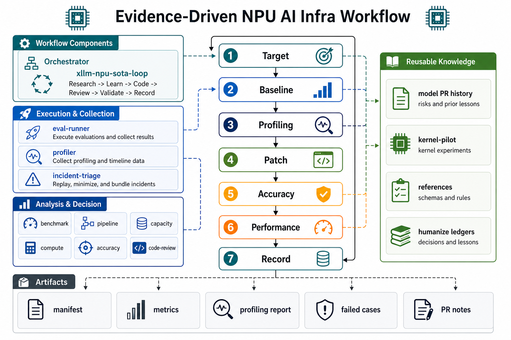

This guide summarizes a practical workflow for xLLM developers who need to
optimize NPU serving, debug regressions, or prepare pull requests with
reproducible evidence.

The workflow is maintained as a separate knowledge base at
[:simple-github: xllm-workflow](https://github.com/xLLM-AI/xllm-workflow). Use
that repository when you want copy-ready agent skills, prompt templates,
artifact schemas, and reusable model optimization history.



## When to use it

Use this workflow when a change needs evidence beyond a normal code review:

- optimizing TTFT, TPOT, TPS, memory usage, or serving concurrency;
- comparing xLLM with vLLM-Ascend, SGLang NPU, or another serving framework;
- debugging garbled output, dataset score drops, GPU/NPU mismatches, OOM,
  graph replay failures, HCCL issues, or runtime crashes;
- validating an NPU-related PR before it is merged;
- deciding whether an operator migration or kernel-level experiment is needed.

Do not treat one smoke run as a formal conclusion. Formal performance and
accuracy claims should include the exact command, environment, workload, raw
artifacts, and normalized summaries.

## Evidence loop

For performance and correctness-sensitive work, follow this loop:

```text
target -> baseline -> profiling -> patch -> accuracy -> performance -> record
```

The key rule is to keep benchmark, profiling, and accuracy evidence separate.
Profiling explains bottlenecks, but it does not replace warmed-up before/after
performance measurements.

Use these phases for a complete optimization task:

| Phase | Purpose | Output |
|---|---|---|
| Target and environment | Define the goal, model, framework commit, hardware, CANN/runtime versions, workload, and SLA. | Run manifest |
| Historical knowledge | Check prior model PRs, failed attempts, and known risky paths. | History notes |
| Fair baseline | Run warmed-up baseline tests before code or parameter changes. | Raw metrics and summary |
| Evidence collection | Collect profiling, capacity, pipeline, compute, or accuracy evidence based on the symptom. | Diagnostic report |
| Patch | Make one meaningful, reviewable change per round whenever practical. | Code diff |
| Validate | Re-run accuracy, performance, build, and UT checks appropriate to the change. | Validation table |
| Record | Preserve commands, metrics, failed attempts, risk notes, and follow-up work. | Reusable lesson |

## Developer checklist

Before opening or updating an NPU optimization PR, make sure the PR description
can answer these questions:

- What model, tokenizer, dtype, device type, device count, and framework commit
  were used?
- What exact startup command and benchmark command were used?
- Was the baseline warmed up and run on clean devices?
- Are profiling results used only as diagnostic evidence?
- Which accuracy level was run, and where are failed cases stored if any?
- What changed in the patch, and what risk remains?
- Which artifacts can another developer use to replay the conclusion?

## Recommended artifacts

For formal results, keep these artifacts together under the same run root:

- `manifest.md` or `manifest.yaml` with environment and command details;
- raw evalscope or benchmark output;
- normalized `metrics.json` or `summary.md`;
- profiling report and timeline notes when profiling is used;
- `failed_cases.jsonl` or equivalent bad-case records for accuracy work;
- PR notes that summarize what changed, why it is safe, and how it was
  validated.

The workflow repository provides shared schemas for these artifacts:

- `references/run-manifest-template.md`
- `references/perf-artifact-schema.md`
- `references/profiling-artifact-schema.md`
- `references/accuracy-artifact-schema.md`

## Related skills

The workflow repository includes task-oriented skills that can be loaded by
Codex, Claude Code, opencode, or another local agent runtime:

| Task | Skill |
|---|---|
| End-to-end optimization | `xllm-npu-sota-loop` |
| Service startup and evalscope collection | `xllm-npu-eval-runner` |
| Fair framework comparison | `xllm-npu-benchmark` |
| msprof / MindStudio analysis | `xllm-npu-profiler` |
| Decode bubble and rank-skew analysis | `xllm-npu-pipeline-analysis` |
| HBM, KV cache, and OOM analysis | `xllm-npu-capacity-planner` |
| FLOPs, MFU, and lower-bound estimates | `xllm-npu-compute-simulation` |
| Accuracy regression debugging | `xllm-npu-accuracy-debug` |
| Crash or runtime incident triage | `xllm-npu-incident-triage` |
| NPU code review | `xllm-npu-code-review` |
| Operator migration | `xllm-npu-op-migration` |

These skills are aids for disciplined engineering. The final judgment still
depends on reproducible xLLM artifacts and reviewable code changes.
