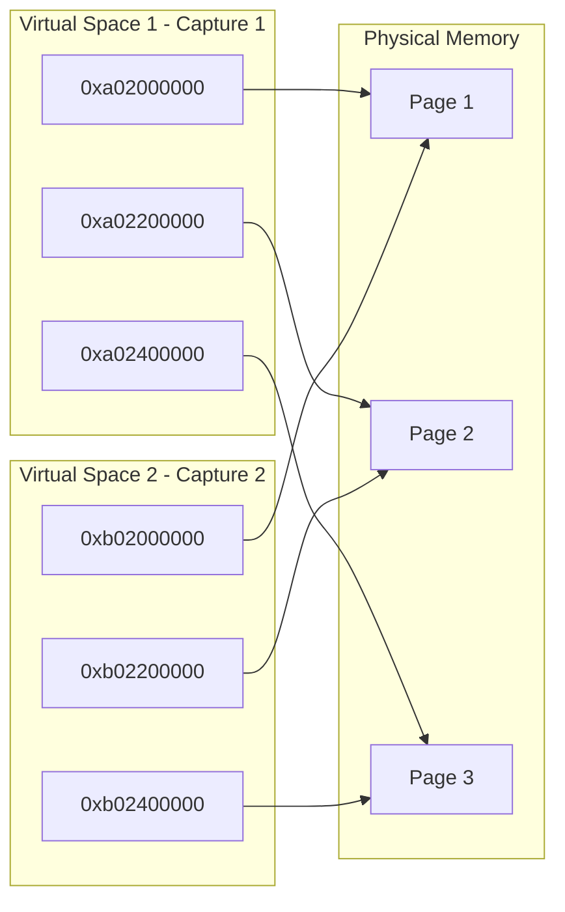

# xLLM Graph Mode 多 Shape 复用内存技术文档

## 概述

本文档描述了 xLLM 中 Graph Mode（包括 CUDAGraph、ACLGraph、MLUGraph）的多 shape 复用内存方案。该方案包含两部分已实现机制：（1）**Graph 捕获期显存复用**：不同 shape 的 Graph 共享物理内存，将显存占用从 `sum(shape)` 降低到 `max(shape)`，底层通过 CUDA Virtual Memory Management (VMM) API 的多虚拟地址空间映射实现；（2）**多 shape 输入 tensor 复用**：通过持久化参数（PersistentParam）预分配最大 shape 的 buffer，replay 时用 slice 适配不同 actual shape，使输入侧显存也保持为 `max(shape)`。

**适用范围**：
- **CUDAGraph**：CUDA 平台的 Graph Mode（当前主要实现）
- **ACLGraph**：NPU 平台的 Graph Mode（架构支持，待适配）
- **MLUGraph**：MLU 平台的 Graph Mode（架构支持，待适配）

## 1. 问题背景

### 1.1 问题描述

在使用 Graph Mode（CUDAGraph/ACLGraph/MLUGraph）进行不同 shape 的推理时，发现 GPU/NPU/MLU 显存占用随 capture 次数线性增长，内存使用量达到 `sum(shape)` 而不是期望的 `max(shape)`。

### 1.2 根本原因

- PyTorch 的 `CUDACachingAllocator`（CUDA 平台）或其他平台的 allocator 为每次 Graph capture 分配独立的内存块
- Graph Mode 的特性要求内存地址在 capture 和 replay 之间保持稳定
- 不同 shape 的 Graph 需要不同的内存布局，导致每个 shape 都需要独立的内存
- 由于 Graph 可能随时被 replay，这些内存无法释放，导致内存累积
- 最终内存使用量 = `sum(shape)` 而不是期望的 `max(shape)`

### 1.3 约束条件

- 不同 shape 的 Graph **不会同时 replay**，允许共享底层物理内存
- 需要支持动态出现的新 shape，按需进行 graph capture
- **不允许**对已捕获的 shape 进行重新捕获（所有 shape 必须缓存）

### 1.4 问题解决过程中的技术难点

在实现内存复用方案时，遇到了以下技术难点：

**难点 1：虚拟地址复用冲突**

初始方案尝试通过 `reset_allocation_pointer()` 复用相同的虚拟地址空间：
- 每次 capture 前重置分配指针到起始位置
- 期望不同 shape 的 Graph 复用相同的虚拟地址

**遇到的问题**：
- PyTorch 的 `CUDACachingAllocator` 使用 `allocated_blocks` map 按地址跟踪内存块
- 复用虚拟地址时，新分配的地址会覆盖 `allocated_blocks` 中的旧条目
- 旧 Graph 中的 tensor 析构时调用 `free()`，但地址已不在 `allocated_blocks` 中
- 触发 `invalid device pointer` 错误，导致程序崩溃

**解决方案**：
- 采用多 shape 复用内存方案：每次 capture 使用新的虚拟地址（底层实现）
- 所有 shape 的 Graph 共享相同的物理内存
- 既避免了地址冲突，又实现了物理内存复用

## 2. 其他产品的类似问题和解法

### 2.1 vLLM 的方案

**vLLM 采用的方法**：

1. **共享内存池**：
   - 使用 `torch.cuda.graph_pool_handle()` 获取一个共享的内存池
   - 所有不同 shape 的 Graph 共享同一个内存池
   - 代码位置：`vllm/v1/worker/gpu/cudagraph_utils.py`
   ```python
   self.pool = torch.cuda.graph_pool_handle()
   ```

2. **捕获顺序优化**：
   - **先捕获大 shape，再捕获小 shape**
   - 小 shape 可以复用大 shape 分配的内存池中的空闲块
   - 实现方式：在 `capture_graphs()` 函数中按降序排序
   ```python
   # Capture larger graphs first.
   sizes_to_capture = sorted(set(cudagraph_sizes.values()), reverse=True)
   ```

3. **内存管理**：
   - 依赖 PyTorch 的 `CUDACachingAllocator` 的内存池管理
   - 通过捕获顺序来最大化内存复用
   - 在 `capture_model()` 中明确注释：
     ```python
     # Capture the large shapes first so that the smaller shapes
     # can reuse the memory pool allocated for the large shapes.
     ```

**局限性**：
- 仍然可能出现内存累积：每个 Graph 持有自己的内存块，即使不活跃也无法释放
- 内存复用依赖于内存池的空闲块管理，不够彻底
- 当不同 shape 数量较多时，内存占用仍然会线性增长

### 2.2 SGLang 的方案

**SGLang 采用的方法**：

1. **全局内存池**：
   - 使用 `torch.cuda.graph_pool_handle()` 或全局 graph memory pool
   - 在 `piecewise_cuda_graph_runner.py` 中设置全局内存池：
   ```python
   if get_global_graph_memory_pool() is None:
       set_global_graph_memory_pool(self.device_module.graph_pool_handle())
   set_graph_pool_id(get_global_graph_memory_pool())
   ```

2. **捕获顺序优化**：
   - 同样采用**先捕获大 shape，再捕获小 shape**的策略
   - 在 `cuda_graph_runner.py` 中明确注释：
     ```python
     # Capture the large shapes first so that the smaller shapes
     # can reuse the memory pool allocated for the large shapes.
     ```

3. **多模态场景的特殊处理**：
   - 针对 ViT（Vision Transformer）等多模态编码器，SGLang 有专门的 CUDA Graph 实现
   - 文档中提到："If there are many distinct S values, we need to increase VRAM usage which is graph-private memory pools for many graphs."
   - （注：VRAM 即 Video RAM，指 GPU 显存）
   - 文档出处：`sglang/docs/advanced_features/cuda_graph_for_multi_modal_encoder.md` 第 26 行
   - 这表明 SGLang 认识到当不同 shape 数量较多时，显存占用会增长（因为每个 graph 有独立的 memory pool）

4. **Piecewise CUDA Graph 支持**：
   - SGLang 支持 piecewise CUDA Graph，可以按层捕获
   - 使用弱引用（weak reference）来减少内存占用

**局限性**：
- 与 vLLM 类似，依赖 PyTorch 内存池管理
- 文档提到：当不同 shape 数量较多时，需要增加显存（VRAM）使用（因为 graph-private memory pools）
- 内存复用依赖于内存池的空闲块管理，当不同 shape 数量较多时，内存占用可能接近 `sum(shape)`

### 2.3 方案对比总结

| 特性 | vLLM 方案 | SGLang 方案 | xLLM 方案 |
|------|-----------|-------------|-----------|
| **内存复用机制** | 共享内存池 + 捕获顺序优化 | 全局内存池 + 捕获顺序优化 + Piecewise Graph | 多 shape 复用内存（多虚拟地址空间映射同一物理内存） |
| **物理内存使用** | 可能达到 `sum(shape)` | 可能接近 `sum(shape)`（文档提到 graph-private pools） | `max(shape)` ✅ |
| **地址冲突** | 无（共享内存池） | 无（全局内存池） | 无（不同虚拟地址） |
| **实现复杂度** | 低（使用 PyTorch 现有机制） | 低-中（支持 Piecewise） | 中（需要自定义 VMM allocator + 支持 Piecewise） |
| **内存效率** | 依赖内存池管理 | 依赖内存池管理 | 最优 ✅ |
| **特殊场景支持** | 标准 CUDA Graph | Piecewise Graph + 多模态 | Piecewise Graph（已实现）<br>CUDAGraph（已实现）<br>ACLGraph/MLUGraph（架构支持） |
| **内存增长问题** | 不同 shape 多时会增长到 `sum(shape)` | 文档提到不同 shape 多时会增加显存使用（graph-private pools） | 增长到 `max(shape)` 后停止 ✅ |

## 3. xLLM 中间激活值多 Shape 复用解法

### 3.1 核心思路

**多 shape 复用内存**：

- **功能目标**：不同 shape 的 Graph 共享物理内存，显存占用 = `max(shape)` 而不是 `sum(shape)`
- **实现机制**：每次 Graph capture 使用新的虚拟地址空间，所有虚拟地址空间映射到相同的物理内存
- **地址隔离**：PyTorch 的 `allocated_blocks`（CUDA 平台）或其他平台的块管理机制使用不同虚拟地址，避免冲突
- **内存效率**：物理内存使用量 = `max(shape)`

**平台支持**：
- **CUDA 平台**：使用 CUDA VMM API 实现（当前实现）
- **NPU/MLU 平台**：架构设计支持，需要适配对应平台的 VMM API

**Graph 模式支持**：
- **标准 CUDA Graph**：支持 decode 阶段的完整 Graph capture
- **Piecewise CUDA Graph**：支持 prefill 阶段的按层捕获（piecewise capture）
- 两种模式都使用相同的多 shape 复用内存机制

### 3.2 架构图



### 3.3 关键技术

**CUDA Virtual Memory Management (VMM) API**：

- `cuMemAddressReserve`: 保留虚拟地址空间
- `cuMemCreate`: 创建物理内存句柄
- `cuMemMap`: 将物理内存映射到虚拟地址空间
- `cuMemUnmap`: 取消映射
- `cuMemRelease`: 释放虚拟地址空间或物理内存句柄
- `cuMemSetAccess`: 设置内存访问权限

**关键特性**：同一个物理内存句柄可以映射到多个虚拟地址空间。

### 3.4 实现架构

#### 3.4.1 组件结构

```
┌─────────────────────────────────────────────────────┐
│         CudaGraphExecutorImpl                      │
│  - reset_vmm_allocator_offset()                           │
│  - get_vmm_mempool_ptr()                          │
│  - MemPoolContext activation                      │
└────────────────┬────────────────────────────────────┘
                 │
                 ▼
┌─────────────────────────────────────────────────────┐
│         VMMTorchAllocator                           │
│  - raw_alloc() / raw_alloc_with_stream()           │
│  - raw_delete()                                     │
│  - Implements CUDAAllocator interface              │
└────────────────┬────────────────────────────────────┘
                 │
                 ▼
┌─────────────────────────────────────────────────────┐
│         SharedVMMAllocator                          │
│  - switch_to_new_virtual_space()                   │
│  - allocate()                                      │
│  - extend_mapping()                                │
│  - Manages VirtualSpace[] and PhyMemHandle[]      │
└────────────────┬────────────────────────────────────┘
                 │
                 ▼
┌─────────────────────────────────────────────────────┐
│         vmm_api (Platform abstraction)              │
│  - create_vir_ptr()                                │
│  - create_phy_mem_handle()                         │
│  - map() / unmap()                                 │
│  - release_vir_ptr() / release_phy_mem_handle()    │
└─────────────────────────────────────────────────────┘
```

#### 3.4.2 核心类设计

**SharedVMMAllocator**：

- **职责**：管理物理内存和多个虚拟地址空间
- **关键数据结构**：
  ```cpp
  struct VirtualSpace {
    VirPtr base_ptr;       // 虚拟地址基址
    size_t reserved_size;  // 保留的虚拟地址空间大小
    size_t mapped_size;    // 已映射的物理内存大小
  };
  std::vector<VirtualSpace> virtual_spaces_;  // 所有虚拟地址空间
  std::vector<PhyMemHandle> handles_;        // 物理内存句柄（共享）
  ```
- **关键方法**：
  - `switch_to_new_virtual_space()`: 创建新的虚拟地址空间并映射已有物理内存
  - `allocate()`: 从当前虚拟空间分配内存
  - `extend_mapping()`: 创建新物理内存并映射到所有虚拟空间

**VMMTorchAllocator**：

- **职责**：将 `SharedVMMAllocator` 适配到 PyTorch 的 `CUDAAllocator` 接口
- **关键方法**：
  - `raw_alloc()` / `raw_alloc_with_stream()`: 调用 `SharedVMMAllocator::allocate()`
  - `raw_delete()`: 调用 `SharedVMMAllocator::deallocate()` (no-op)

**集成点**（在 `CudaGraphExecutorImpl` 中）：

```cpp
// 1. 在 capture 前切换到新虚拟地址空间
reset_vmm_allocator_offset(device_.index());

// 2. 激活 VMM MemPool（CUDA 平台使用 PyTorch MemPool）
c10::cuda::MemPoolContext mempool_ctx(get_vmm_mempool_ptr());

// 3. 执行 capture（此时所有分配会使用 VMM allocator）
graph->capture(...);
```

### 3.5 实现细节

#### 3.5.1 文件结构

```
xllm/xllm/core/platform/
├── shared_vmm_allocator.h          # SharedVMMAllocator 头文件（平台无关）
├── shared_vmm_allocator.cpp         # SharedVMMAllocator 实现（平台无关）
├── vmm_torch_allocator.h            # VMMTorchAllocator 头文件（CUDA 平台）
├── vmm_api.h                        # VMM API 抽象层（多平台）
└── vmm_api.cpp                      # VMM API 实现（当前为 CUDA，支持扩展）

xllm/xllm/core/runtime/
├── cuda_graph_executor_impl.h       # CUDAGraph 集成点声明
└── cuda_graph_executor_impl.cpp     # CUDAGraph 集成点实现
```

#### 3.5.2 关键实现流程

**Capture 流程**：

```
1. reset_vmm_allocator_offset(device_id)
   └─> SharedVMMAllocator::switch_to_new_virtual_space()
       ├─> vmm::create_vir_ptr()  // 创建新虚拟空间
       ├─> 遍历 handles_，映射到新虚拟空间
       └─> virtual_spaces_.push_back(new_space)

2. MemPoolContext mempool_ctx(get_vmm_mempool_ptr())
   └─> 激活 VMM MemPool，后续分配使用 VMMTorchAllocator

3. graph->capture(...)
   └─> 所有内存分配通过 VMMTorchAllocator::raw_alloc()
       └─> SharedVMMAllocator::allocate()
           └─> 从当前虚拟空间分配
```

**内存扩展流程**：

```
SharedVMMAllocator::extend_mapping(new_size)
├─> while (mapped_size_ < new_size)
│   ├─> vmm::create_phy_mem_handle()  // 创建新物理内存
│   └─> for (auto& space : virtual_spaces_)
│       └─> vmm::map(space.base_ptr + offset, handle)
│           └─> 映射到所有虚拟空间
└─> mapped_size_ += granularity
```

### 3.6 关键技术点

#### 3.6.1 VMM API 使用（CUDA 平台实现）

**虚拟地址空间创建**：
```cpp
VirPtr base_ptr;
vmm::create_vir_ptr(base_ptr, reserved_size);
// CUDA 平台底层调用 cuMemAddressReserve
```

**物理内存创建**：
```cpp
PhyMemHandle handle;
vmm::create_phy_mem_handle(handle, device_id);
// CUDA 平台底层调用 cuMemGetAllocationGranularity + cuMemCreate
```

**映射物理内存到虚拟空间**：
```cpp
vmm::map(vir_ptr, phy_mem_handle, device_id);
// CUDA 平台底层调用 cuMemMap + cuMemSetAccess
```

#### 3.6.2 PyTorch 集成（CUDA 平台）

**MemPool 机制**：
- `c10::cuda::MemPool` 在构造时绑定 `CUDAAllocator*`
- `c10::cuda::MemPoolContext` 在作用域内激活 MemPool
- `beginAllocateToPool()` / `endAllocateToPool()` 将分配路由到 MemPool 的 allocator

**关键接口实现**：
- `CUDAAllocator::raw_alloc()`: 核心分配接口
- `CUDAAllocator::raw_delete()`: 释放接口（VMM 中为 no-op）

## 4. xLLM  输入 Tensor 多 Shape 的复用

除第 3 节「Graph 捕获期显存」通过 VMM 多虚拟地址复用物理内存外，xLLM 还对**多 shape 下的输入 tensor** 做了复用，避免按 shape 各占一份输入显存。该机制已实现并用于 CUDAGraph、ACLGraph、MLUGraph。

**思路**：  
- 为 Graph 预分配**一组**与「最大 shape」一致的**持久化 buffer**（tokens、positions、q_seq_lens、kv_seq_lens、block_tables、hidden_states 等）。  
- Replay 时不论当前请求的 actual shape 多大，都**只使用这组 buffer**：先把当次输入拷贝到 buffer 的对应前段，再通过 **slice** 得到与当前 actual shape 一致的视图传给 forward。  
- 因此输入侧显存只占 **max(shape)** 一份，不同 shape 复用同一组 buffer。

**实现要点**：

1. **持久化参数类**（如 `CudaGraphPersistentParam` / ACL/MLU 的 `GraphPersistentParam`）：  
   - 构造时按「最大」维度分配：`max_tokens_per_batch`、`max_seqs_per_batch`、`max_block_table_len` 等。  
   - 所有输入/输出相关 tensor（tokens、positions、new_cache_slots、block_tables、q_seq_lens、kv_seq_lens、hidden_states 等）均使用这批固定大小的 buffer。

2. **Replay 前写入**：  
   - 调用 `update()` / `update_input_buffer()`，将当次请求的 tokens、positions、ModelInputParams 等拷贝到上述 buffer 的**前 actual 段**（必要时对 padding 区域填 0）。  
   - 拷贝使用 `persistent_*.slice(0, 0, actual_*).copy_(input, true)` 等形式，只写实际用到的区间。

3. **Replay 时传 slice 视图**：  
   - forward 使用的输入不重新分配，而是通过 getter 得到「当前 actual shape」的 slice，例如：  
     - `persistent_tokens(actual_tokens)` → `persistent_tokens_.slice(0, 0, actual_tokens)`  
     - `persistent_positions(actual_tokens)`、`persistent_block_tables(actual_batch_size)` 等同理。  
   - 这样同一份 buffer 在不同 shape 的 replay 之间复用，显存为 **max(shape)**。

**效果**：  
- 多 shape 下**输入 tensor 显存**从按 shape 多份占用降为 **max(shape)** 一份。  
- 与第 3 节「捕获期显存」VMM 复用组合后，整体显存行为为：**捕获期**物理显存约 **max(shape)**，**输入侧**也为 **max(shape)**，均为当前已实现方案。

**代码位置参考**：  
- CUDA：`xllm/core/runtime/cuda_graph_executor_impl.cpp`（`CudaGraphPersistentParam` 构造与 `update()`，以及 `persistent_tokens()` 等 getter）。  
- ACL：`acl_graph_executor_impl.cpp` 中 `GraphPersistentParam::update()` 与持久化 tensor 的 slice。  
- MLU：`mlu_graph_executor_impl.cpp` 中 `GraphPersistentParam::update_input_buffer()` 与 slice。

## 5. 最终的效果

### 5.1 内存效率

| 指标 | 之前方案 | 新方案 |
|------|---------|--------|
| 物理内存 | `sum(shape)` | `max(shape)` ✅ |
| 虚拟地址空间 | `max(shape)` | `sum(shape)` |
| 稳定性 | 地址冲突崩溃 | 稳定 ✅ |

### 5.2 性能影响

- **Capture 阶段**：`switch_to_new_virtual_space()` 需要映射所有物理内存，开销为 O(物理页数)
- **Replay 阶段**：无额外开销，与标准 Graph Mode replay 相同（CUDAGraph/ACLGraph/MLUGraph）
- **内存分配**：O(1)，从当前偏移量分配

### 5.3 虚拟地址空间开销

- 64 位系统通常有 48 位有效虚拟地址空间（256TB）
- 每个虚拟空间约 1.125x device memory（例如 80GB GPU = 90GB VA）
- 理论上可支持数千个不同 shape 的 capture

### 5.4 测试验证

✅ **内存复用**：不同 shape 的 capture 共享物理内存  
✅ **地址唯一性**：每个 capture 使用不同的虚拟地址  
✅ **稳定性**：长时间压测无 `invalid device pointer` 错误  
✅ **内存占用**：显存占用从 `sum(shape)` 降低到 `max(shape)`

### 5.5 实际效果

- **显存占用**：从 `sum(shape)` 降低到 `max(shape)`，显著减少显存使用
- **稳定性**：解决了虚拟地址复用导致的 `invalid device pointer` 错误
- **扩展性**：支持动态出现的新 shape，按需进行 graph capture
- **平台支持**：CUDA 平台已实现，NPU/MLU 平台架构支持待适配

## 6. 注意事项与限制

### 6.1 注意事项

1. **虚拟地址空间清理**：
   - 当前实现保留所有虚拟空间直到析构
   - 未来可优化：在 Graph 不再使用时释放旧虚拟空间

2. **多 GPU 支持**：
   - 每个设备有独立的 `SharedVMMAllocator` 实例
   - `device_id` 参数确保正确映射

3. **内存对齐**：
   - 所有分配按 `granularity` 对齐，可能有少量浪费
   - 对齐开销通常 < 1%

### 6.2 限制

1. **平台支持状态**：
   - **CUDA 平台**：已实现（使用 CUDA VMM API）
   - **NPU 平台（ACLGraph）**：架构支持，待适配 NPU VMM API
   - **MLU 平台（MLUGraph）**：架构支持，待适配 MLU VMM API
   - 当前 `VMMTorchAllocator` 仅适配 CUDA 平台的 PyTorch 接口

2. **虚拟地址空间增长**：
   - 理论上无限制，但实际受系统限制
   - 64 位系统通常足够使用

3. **不支持动态释放**：
   - 物理内存在 allocator 生命周期内不释放
   - 虚拟空间在析构时统一清理

## 7. 未来优化方向

1. **虚拟空间清理**：
   - 跟踪 Graph 生命周期（CUDAGraph/ACLGraph/MLUGraph）
   - 在 Graph 不再使用时释放对应虚拟空间

2. **内存碎片整理**：
   - 支持物理内存的重新映射
   - 减少虚拟地址空间碎片

3. **多平台支持**：
   - **NPU 平台（ACLGraph）**：适配 NPU VMM API，在 `AclGraphExecutorImpl` 中集成
   - **MLU 平台（MLUGraph）**：适配 MLU VMM API，在 `MluGraphExecutorImpl` 中集成
   - 统一 VMM API 抽象，支持不同硬件平台的虚拟内存管理
   - 为各平台实现对应的 Allocator 适配器（类似 `VMMTorchAllocator`）

## 8. 参考文档

### 8.1 CUDA 平台

- [CUDA Virtual Memory Management](https://docs.nvidia.com/cuda/cuda-driver-api/group__CUDA__VM.html)
- [PyTorch CUDACachingAllocator](https://github.com/pytorch/pytorch/blob/main/c10/cuda/CUDACachingAllocator.h)
- [CUDA Graph Capture](https://docs.nvidia.com/cuda/cuda-c-programming-guide/index.html#cuda-graphs)
- [vLLM CUDA Graph Implementation](https://github.com/vllm-project/vllm/blob/main/vllm/v1/worker/gpu/cudagraph_utils.py)
- [SGLang CUDA Graph Implementation](https://github.com/sgl-project/sglang/blob/main/python/sglang/srt/model_executor/cuda_graph_runner.py)

### 8.2 xLLM Graph Mode

- [xLLM CUDAGraph 实现](../../xllm/core/runtime/cuda_graph_executor_impl.h)
- [xLLM ACLGraph 实现](../../xllm/core/runtime/acl_graph_executor_impl.h)
- [xLLM MLUGraph 实现](../../xllm/core/runtime/mlu_graph_executor_impl.h)

---

**文档版本**：v1.0  
**最后更新**：2025-01-29  
**作者**：xLLM Team
